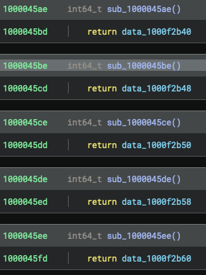
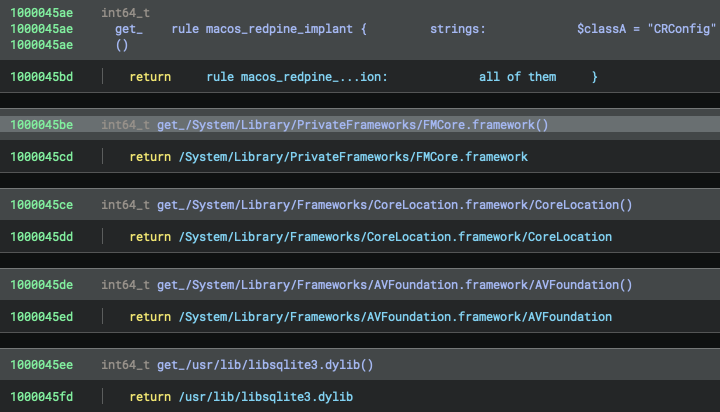

# Binja XProtect Remediator Analyzer

A Binary Ninja plugin for analyzing XProtect Remediator binaries.

## Description

XProtect Remediator Analyzer is a Binary Ninja plugin developed to assist in the analysis of XProtect Remediator. It has been tested with XProtect Remediator versions 145 and 149.

## Features

### Annotate `_assess` functions command

The RemediationBuilder DSL defines several structures used to describe detection and remediation conditions. These structures are type-erased and converted into generalized types such as `AnyFileCondition`, `AnyServiceCondition`, `AnyProcessCondition`, and `AnySafariAppExtensionCondition`.
Each condition structure includes a property named `_assess`, which evaluates whether the condition is satisfied for a given subject.

```swift
let _assess: (Subject) -> Bool
```

For more details on the RemediationBuilder DSL, please refer to the [RemediationBuilderDSLSpec repository](https://github.com/FFRI/RemediationBuilderDSLSpec).

In XProtectRemediator binaries, symbols for the `_assess` functions are stripped. However, their addresses can still be identified by analyzing the Protocol Witness Tables (PWTs) of protocols such as `FileConditionConvertible`, `ServiceConditionConvertible`, `ProcessConditionConvertible`, and `SafariAppExtensionConditionConvertible`.
The “Annotate `_assess` functions” command locates these functions and assigns descriptive names to them accordingly.


This function is useful for understanding how conditions are evaluated during threat detection and remediation.

### Annotate RemediationBuilder dump command

When dumping array elements in LLDB—such as those collected via `buildBlock` and `buildArray` functions of `FileRemediationBuilder`, `ServiceRemediationBuilder`, `ProcessRemediationBuilder`, or `SafariAppExtensionRemediationBuilder`—the output is displayed as follows. Here, the custom LLDB command `p_boxed_array` (available [here](https://github.com/kohnakagawa/LLDB)) is used.

```
(lldb) p_boxed_array $arg1
```

The dumped output is as follows.

```
(lldb) r
... (omitted)
Process 40414 stopped
* thread #1, queue = 'com.apple.main-thread', stop reason = breakpoint 1.1
    frame #0: 0x0000000100097255 XProtectRemediatorEicar` ___lldb_unnamed_symbol4984  + 197
XProtectRemediatorEicar`___lldb_unnamed_symbol4984:
->  0x100097255 <+197>: call   0x100087e90               ; ___lldb_unnamed_symbol4716
    0x10009725a <+202>: mov    r15, rax
    0x10009725d <+205>: mov    rdi, r14
    0x100097260 <+208>: call   0x100097c90               ; ___lldb_unnamed_symbol5027
    0x100097265 <+213>: mov    rdi, rbx
    0x100097268 <+216>: call   0x1000b0308               ; symbol stub for: swift_release
    0x10009726d <+221>: mov    rax, r15
    0x100097270 <+224>: add    rsp, 0x98
Target 0: (XProtectRemediatorEicar) stopped.
(lldb) re read $arg1
     rdi = 0x00007ff7bfefeed8
(lldb) p_boxed_array 0x00007ff7bfefeed8
([Empty]) $R0 = 1 value {
  [0] = {
    paths = 1 value {
      [0] = 0x0000600000069060 {
        logger = 0x0000600000069040 {
          logger = 0x00006000015683c0 {
            baseOS_object@0 = {
              baseNSObject@0 = {
                isa = OS_os_log
              }
            }
          }
        }
        url = "file:///tmp/eicar"
      }
    }
    predicate = nil
    searchDir = nil
    searchDepth = nil
    regexpArray = 0 values {}
    isFileSearchRemediation = false
    isPredicateSearchRemediation = false
    reportOnlyBool = false
    conditions = 2 values {
      [0] = {
        constraint = 68
        _assess = 0x0000000100083110 XProtectRemediatorEicar`___lldb_unnamed_symbol4233
      }
      [1] = {
        constraint = {
          payload_data_0 = 0x00006000024682a0 {
            description = "YaraRule[32 bytes]"
            compiler = 0x7fef1200f400 {
              pointee = {}
            }
            rules = 0x6000023681e0 {
              pointee = {}
            }
            signpost_compile_name = "YARA_Compile"
            callbackV3 = {}
            callbackV4 = {}
          }
          payload_data_1 = 0x0000000000000000
          payload_data_2 = 0x0000000000000000
          metadata = 0x00000001000f1c08
          wtable = 0x00007ff85f269ac8 libswiftCore.dylib`InitialAllocationPool + 23976
        }
        _assess = 0x0000000100082ef0 XProtectRemediatorEicar`___lldb_unnamed_symbol4221
      }
    }
  }
}
```

In this output, the address of the `_assess` function within an `AnyFileCondition` is displayed. However, since the symbols are stripped, it is not possible to determine the original structure prior to its conversion to `AnyFileCondition`.
The “Annotate RemediationBuilder dump” command resolves this by identifying the original structure and assigning appropriate names to the corresponding functions.

The usage is as follows:

1. In LLDB, dump the array elements collected via `buildBlock` or `buildArray` functions of `FileRemediationBuilder`, `ServiceRemediationBuilder`, `ProcessRemediationBuilder`, or `SafariAppExtensionRemediationBuilder`.
2. Execute the “Annotate RemediationBuilder dump” command. A text input box will appear—paste the output from step 1 into this box.
3. The tool will annotate the original structure name prior to its conversion to `AnyFileCondition` for each `_assess` function. (See the conditions array in the annotated output below.)

The following is the example output of the “Annotate RemediationBuilder dump” command.

```
(lldb) r
... (omitted)
Process 40414 stopped
* thread #1, queue = 'com.apple.main-thread', stop reason = breakpoint 1.1
    frame #0: 0x0000000100097255 XProtectRemediatorEicar` ___lldb_unnamed_symbol4984  + 197
XProtectRemediatorEicar`___lldb_unnamed_symbol4984:
->  0x100097255 <+197>: call   0x100087e90               ; ___lldb_unnamed_symbol4716
    0x10009725a <+202>: mov    r15, rax
    0x10009725d <+205>: mov    rdi, r14
    0x100097260 <+208>: call   0x100097c90               ; ___lldb_unnamed_symbol5027
    0x100097265 <+213>: mov    rdi, rbx
    0x100097268 <+216>: call   0x1000b0308               ; symbol stub for: swift_release
    0x10009726d <+221>: mov    rax, r15
    0x100097270 <+224>: add    rsp, 0x98
Target 0: (XProtectRemediatorEicar) stopped.
(lldb) re read $arg1
     rdi = 0x00007ff7bfefeed8
(lldb) p_boxed_array 0x00007ff7bfefeed8
([Empty]) $R0 = 1 value {
  [0] = {
    paths = 1 value {
      [0] = 0x0000600000069060 {
        logger = 0x0000600000069040 {
          logger = 0x00006000015683c0 {
            baseOS_object@0 = {
              baseNSObject@0 = {
                isa = OS_os_log
              }
            }
          }
        }
        url = "file:///tmp/eicar"
      }
    }
    predicate = nil
    searchDir = nil
    searchDepth = nil
    regexpArray = 0 values {}
    isFileSearchRemediation = false
    isPredicateSearchRemediation = false
    reportOnlyBool = false
    conditions = 2 values {
      [0] = {
        constraint = 68
        // You can find that the structure before conversion to AnyFileCondition is `MinFileSize`
        _assess = 0x0000000100083110 (Assess of MinFileSize for FileConditionConvertible) XProtectRemediatorEicar`___lldb_unnamed_symbol4233
      }
      [1] = {
        constraint = {
          payload_data_0 = 0x00006000024682a0 {
            description = "YaraRule[32 bytes]"
            compiler = 0x7fef1200f400 {
              pointee = {}
            }
            rules = 0x6000023681e0 {
              pointee = {}
            }
            signpost_compile_name = "YARA_Compile"
            callbackV3 = {}
            callbackV4 = {}
          }
          payload_data_1 = 0x0000000000000000
          payload_data_2 = 0x0000000000000000
          metadata = 0x00000001000f1c08
          wtable = 0x00007ff85f269ac8 libswiftCore.dylib`InitialAllocationPool + 23976
        }
        // You can find that the structure before conversion to AnyFileCondition is `FileYara`
        _assess = 0x0000000100082ef0 (Assess of FileYara for FileConditionConvertible) XProtectRemediatorEicar`___lldb_unnamed_symbol4221
      }
    }
  }
}
```

### Annotate obfuscated strings command

XProtectRemediator stores YARA rules, file paths, regular expressions, and other detection-related information in an encrypted format, which is decrypted at runtime.
The “Annotate obfuscated strings” command displays the contents of these encrypted strings in the Binary Ninja database.

The usage is as follows:

1. Run [./dump_secret_config/run.sh](./dump_secret_config/run.sh) to output segment data containing decrypted strings.
2. Execute the “Annotate obfuscated strings” command. A file selection dialog will appear—select one or more .bin files generated in step 1.

After running this plugin, information about the decrypted strings is added to the Binary Ninja database, making them visible within the disassembly and string views.

**Before**



**After**



## Author

Koh M. Nakagawa (@tsunek0h). &copy; FFRI Security, Inc. 2025

## License

[Apache version 2.0](LICENSE)
